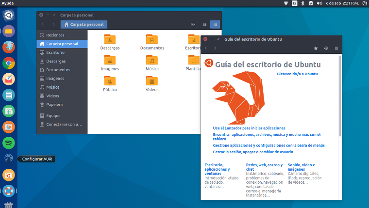
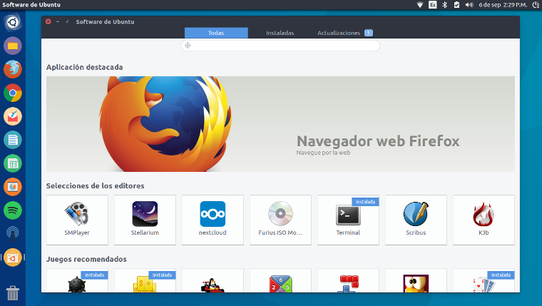
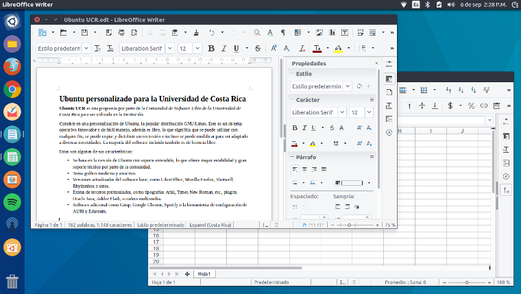

# Customized Ubuntu for the University of Costa Rica

**Ubuntu UCR** is a proposal from the *Community of Software Libre of the University of Costa Rica* to be used as the institutionalized Linux distribution.

It consist on a customization of Ubuntu, the popular GNU/Linux distribution.

This innovative and easy to use operating system is also open source, this means that it can be used to any means, is possible to copy and distribute it without restriction and even can be modified to be adapted to particular needs. The mayority of the included software on **Ubuntu UCR** is also open source.

## Features:

- Based on the **long term support** Ubuntu version, this offers more stability and improved support from the community.

- Modern and attractive graphical theme.

- Updated version of base software: LibreOffice, Mozilla Firefox, Shotwell, Rhytmbox and others.

- Third party extras preinstalled: Common typographies like Arial and Times New Roman, Java Oracle plugins, Adobe Flash and multimedia codecs.

- Additional Software: Gimp, Google Chrome, VLC, Spotify, AURI configuration tool and Eduroam.

- Automatic security updates for the system and for multiple software (i.e. LibreOffice).

- Included support for: digital signature readers, national CA certificates and installed banking programs (i.e: BCCR).

- Plugins for LibreOffice: synonyms, ortography checker, grammar checker and others.

- Included support for [Gnome-Shell](https://www.gnome.org/gnome-3) and [MATE](https://mate-desktop.org/) desktop enviroments.

- Built with [bash scripts](https://www.gnu.org/software/bash) and [ansible roles](https://www.ansible.com/) which gives more robustness.

## Screenshots





## Usage

### To customize Ubuntu:

#### Using the ansible galaxy role.

1. Install ansible:

    ```
      sudo apt install ansible -y
    ```

2. Install ubuntu-ucr role from ansible-galaxy:

    ```
      ansible-galaxy install cslucr.ubuntu-ucr
    ```

#### Using the bash script:


1. Download the project:

    ```
      wget https://github.com/cslucr/ubuntu-ucr/archive/master.zip
    ```

2. Unzip the project:

    ```
      unzip master.zip
    ```

3. Enter the unzipped folder:

    ```
      cd ubuntu-ucr-master
    ```

4. Give run permissions to the script:

    ```
      chmod +x ubuntu-ucr-customization.sh
    ```

5. Run the script:

    ```
      ./ubuntu-ucr-customization.sh
    ```

## Download

Images of **Ubuntu UCR**, ready to install, can be downloaded from our [mirrors server](http://espejos.ucr.ac.cr/cslucr).

### Customization Criteria

- Only stable software is included. Development and experimental software is not included.

- The modifications to desktop enviroments are minimal, the configurations stablished by the Ubuntu user experience team are enough.

- Does not try to resemble another system, instead offer an attractive alternative without sacrificing system usability.

- All graphical or icon themes must not confuse the user.

- Focused on the final user or on new GNU/Linux users.

## License

GPL 3.

For more info see [LICENSE](LICENSE).

## Contributing

If you want to report a problem, make sugerencies or add new features, feel free to fork the project and
put a pull request through this platform.

For more info see [CONTRIBUTING.md](CONTRIBUTING.md).

## Authors

*Comunidad de Software Libre de la Universidad de Costa Rica*

[http://softwarelibre.ucr.ac.cr](http://softwarelibre.ucr.ac.cr)